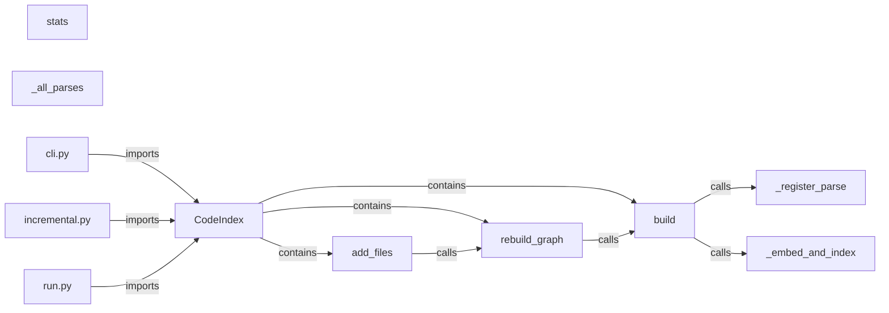

# Code RAG


A **code-aware retrieval-augmented generation (RAG)** system for asking natural-language
questions about a codebase and getting grounded, **citation-backed** answers. It chunks
source on **AST boundaries** with **tree-sitter** (not character windows), retrieves with
**hybrid dense + BM25 search** fused by **Reciprocal Rank Fusion** (with an optional
**cross-encoder** and the measured-best **listwise LLM reranker**), builds a **code graph**
(imports / calls / containment) with **personalized PageRank** for connected context, answers with **Claude** using `[n]` citations plus an
**LLM-as-judge faithfulness** check, and — the centerpiece — ships a rigorous **evaluation
harness** (recall@k / MRR / NDCG, **bootstrap confidence intervals**, **paired significance
tests**). Provider-agnostic (Anthropic or any **OpenAI-compatible** endpoint, incl. local
Ollama); semantic search via **sentence-transformers** embeddings with an optional **HNSW**
(approximate nearest neighbor) backend for scale.

New to RAG / embeddings / the eval methodology? Start with [**docs/LEARN.md**](docs/LEARN.md),
a from-scratch walkthrough. Design rationale lives in [`outline.md`](outline.md); the full
measured write-up is [RESULTS.md](RESULTS.md).

## Features

- **AST-boundary chunking across ~165 languages** — tree-sitter with 18 hand-tuned precise
  language specs (Python, JS, TS, Go, Rust, Ruby, Java, C/C++, C#, PHP, Kotlin, Scala, Swift,
  Lua, Bash, Perl, Objective-C) + a generic pattern classifier, with line-window fallback.
- **Hybrid retrieval** — dense semantic search (sentence-transformers) + lexical BM25, fused
  by Reciprocal Rank Fusion; an optional cross-encoder and a validated listwise LLM reranker
  refine the pool (the cross-encoder is off by default — measured net-negative on code, §3d).
- **Code graph** — imports / calls / class-method containment with import-aware name
  resolution; personalized-PageRank traversal for connected, token-cheap context.
- **Grounded generation** — `[n]`-cited answers, an enforced **abstain** path ("the sources
  don't cover this"), and a RAGAS-style **faithfulness** check that verifies each claim
  against its cited source.
- **Provider-agnostic LLM layer** — Anthropic Claude by default; any OpenAI-compatible
  endpoint (OpenRouter, Together, Groq, Azure, local Ollama / LM Studio / vLLM).
- **Evaluation harness** — file- and symbol-granular recall/precision/MRR/NDCG, bootstrap
  confidence intervals, paired-bootstrap significance, a holdout split, and ablations.
- **External benchmarks** — CodeSearchNet (embedder) and HumanEval / CodeRAG-Bench-style
  (full retriever), so quality is validated off the self-made golden set.
- **Listwise LLM reranker** — the LLM reasons over the candidate pool; the one lever with a
  *significant* recall gain (+0.086, p<0.001) that also lifts answer-correctness.
- **Optional HNSW (ANN) vector backend** (hnswlib) — 16× faster queries at scale; exact
  brute-force matmul is the default.
- **Interactive graph visualizer/editor** — standalone vis-network HTML (search, force /
  hierarchical layouts) plus a live localhost server with persistent edits + reset.
- **MCP server** — exposes `search_code` and `answer_question` tools to agents (Claude Code,
  Cursor, Claude Desktop).
- **Incremental reindex** (content-hash + git-diff), interactive **chat REPL**, **resilience**
  (retry/backoff + timeouts), and **secret hygiene** (gitignored dotenv + secret scanner, CI).

## How It Works

The pipeline is **digest once, probe per query**. At index time: discover files → AST-chunk →
embed (`header + code`) into a vector store → tokenize into a BM25 index → build the code
graph → persist. At query time: embed the question → dense + BM25 search → RRF fuse →
(rerank) → grounded answer with citations → faithfulness verification.

Design decisions, each empirically motivated:

- **AST chunking.** Prose RAG splits on token windows; that shreds code — half a function
  retrieves as noise. Chunks land on definition boundaries: methods are their own chunks,
  classes get a summary chunk, oversized functions are windowed carrying their signature, and
  a module chunk captures imports + top-level code. A chunk's id **is** its `file:line`
  location, so the retrieved unit is already its own citation.
- **Context headers.** Before embedding, each chunk is prefixed with `File / Class / signature
  / docstring` — the embedding then carries location and signature, exactly what code queries
  key off. (The header is embedded, not displayed.)
- **Hybrid retrieval + RRF.** Developers query exact identifiers (`HTTPException`) that
  embeddings smear together; BM25 nails them, aided by a code-aware tokenizer that splits
  `get_current_user` / `getCurrentUser`. Dense and lexical lists are fused by **Reciprocal
  Rank Fusion** (rank-based, so no score calibration). A cross-encoder reranker is wired in
  but **off by default** (measured net-negative on code retrieval — §3d); the listwise LLM
  reranker (`--accurate`) is the validated accuracy lever.
- **Code graph as a token-saver.** Retrieval finds the entry-point chunk; the graph names the
  connected chunks (callees, callers, imports, enclosing class) via a dictionary lookup, so
  the model gets a few precise neighbors plus a compact structural map instead of whole files.
- **Abstain + faithfulness.** The prompt forbids guessing; an LLM judge decomposes the answer
  into atomic claims and checks each against its cited source (`faithfulness = supported /
  total`), backed by a free structural check that every `[n]` resolves to a real source.
- **Evaluation first.** Every component is a toggle so the harness can attribute each one's
  contribution, reported with confidence intervals and paired significance rather than vibes.

A real `CodeIndex` subgraph this repo emits (`graph-export --symbol CodeIndex --format mermaid`):



### Measured results (reproducible, with confidence intervals)

| Dimension | Result |
|---|---|
| Embedder lever (golden set, recall@5) | general 0.83 → code-trained **0.97** (CIs disjoint) |
| External — CodeSearchNet (800 docstring→code) | recall@10 **0.985** · MRR 0.948 |
| External — HumanEval (164 problem→solution) | hybrid recall@10 **0.860** · MRR 0.543 |
| **Official CoIR leaderboard (full 10 tasks)** | CodeRankEmbed mean nDCG@10 **0.619** — beats the paper's best Voyage-Code-002 (0.563) & E5-Mistral-7B (0.552); default 0.377 |
| Scale — Django (521k LOC, ~40k chunks) | indexes in 84 s; BM25 adds **+0.10** recall@5 (significant) |
| Faithfulness (accurately judged) | **~0.95** |
| Test suite | **158 passing** |

### The honest findings (the point of the project)

The value isn't "it works" — it's *measuring what moves the needle and reporting the negatives*:

1. **The embedder is the dominant lever** — a code-trained model lifted recall@5 `0.83 → 0.97`
   (`0.70 → 0.97` on direct lookups), confirmed externally on CodeSearchNet.
2. **A hybrid "win" that was a confound — caught and killed.** Auto-generated questions leaked
   function names into the query, unfairly helping BM25; paraphrasing them out erased the
   advantage (`0.922 → 0.861`).
3. **Most configs don't separate** on a strong embedder + small repo (reported as "no
   separation," not a fake winner) — but **BM25 becomes decisive at scale** (Django +0.10).
4. **Three features measured useless/harmful, then turned off** — HyDE, self-repair (its gain
   was regression-to-the-mean, proven with a control), and a general-domain cross-encoder
   reranker (hurt code retrieval `0.86 → 0.63`).
5. **A faithfulness number that was a measurement artifact** — 0.79 → ~0.95 once the judge
   could see enough of each cited source; the system was already grounded, the judge was blind.
6. **The code graph helps only conditionally** — significant on Go (p=0.019), null on Python.
7. **Researched the SOTA for the remaining gaps** — Granite embedder and Anthropic Contextual
   Retrieval were measured no-ops here, but a **listwise LLM reranker** significantly lifts
   recall (+0.086, p<0.001) *and* answer-correctness (0.73 → 0.90). It **compounds and
   dominates the embedder choice**: best measured config is `CodeRankEmbed + LLM rerank` =
   **recall@5 0.858** (+0.156 over the embedder alone, p<0.001), and any decent embedder +
   the reranker lands in the same range — so the LLM reranker is *the* accuracy lever
   (enable with `--accurate`).

Lever hierarchy that emerged: **LLM rerank (the lever) > chunking > embedder > BM25 (at
scale) > fusion > prompt > graph (conditional) > judge.**

## Skills Demonstrated

- **Retrieval-Augmented Generation (RAG)** — end-to-end retrieve → rerank → generate → verify pipeline over source code
- **Semantic search & embeddings** — sentence-transformers bi-encoder, cosine over L2-normalized vectors, code-trained models
- **Hybrid search** — dense + lexical BM25 (rank-bm25) combined with Reciprocal Rank Fusion
- **Cross-encoder reranking** — sentence-transformers CrossEncoder over (query, chunk) pairs
- **Listwise LLM reranking** — the LLM reasons over the candidate pool to disambiguate near-duplicate symbols
- **AST parsing** — tree-sitter / tree-sitter-language-pack, 18 precise language specs + generic fallback
- **Code graph construction** — imports / calls / containment edges with import-aware name resolution
- **Personalized PageRank** — power iteration with cached adjacency + frontier bounding for graph-aware reranking
- **Approximate nearest neighbor (ANN)** — optional HNSW index via hnswlib behind a shared search interface
- **LLM-as-judge & faithfulness (RAGAS-style)** — atomic-claim decomposition + per-claim source verification
- **Grounded generation** — `[n]` citations, enforced abstention, structural citation checks
- **Prompt engineering** — abstain instruction, JSON-schema judge prompts, listwise rerank prompt
- **Provider-agnostic API design** — Anthropic SDK + OpenAI-compatible adapters, runtime resolution, SDK auto-install
- **Evaluation methodology** — recall@k / precision@k / MRR / NDCG, golden set, holdout split, ablation tables
- **Statistical rigor** — bootstrap confidence intervals, paired-bootstrap significance, confound detection, regression-to-the-mean control
- **Benchmarking** — external CodeSearchNet and HumanEval / CodeRAG-Bench-style harnesses
- **Tokenization** — code-aware identifier splitting (snake_case / camelCase) for lexical search
- **Incremental computation** — content-hash + git-diff reindex of only changed files
- **Performance optimization** — token-budgeted context assembly, cached graph adjacency, dedup/merge of sources
- **Resilience engineering** — retry with exponential backoff + jitter, configurable timeouts/retries
- **Interactive data visualization** — vis-network force-directed + hierarchical graph with an in-browser editor
- **HTTP server** — stdlib ThreadingHTTPServer for the live graph editor (no web deps)
- **CLI design** — argparse multi-command interface (index / query / chat / eval / bench / graph-*)
- **MCP (Model Context Protocol) server** — search + grounded-answer tools for coding agents
- **Testing** — pytest suite (158 tests), torch-free stub embedder, no API key required
- **CI / DevOps** — GitHub Actions workflow
- **Security & secret hygiene** — gitignored dotenv variants, provider-agnostic secret scanner, pre-commit hook

## Tech Stack

- **Language:** Python 3.10+
- **Embeddings / ML:** sentence-transformers, PyTorch, Hugging Face transformers
- **Lexical search:** rank-bm25
- **AST parsing:** tree-sitter, tree-sitter-language-pack
- **Vector search:** NumPy (exact cosine), hnswlib (optional ANN)
- **LLM providers:** Anthropic SDK (`anthropic`), OpenAI SDK (`openai`, for OpenAI-compatible endpoints)
- **Agent integration:** Model Context Protocol (`mcp`)
- **Graph visualization:** vis-network (CDN), Graphviz DOT / Mermaid export
- **Benchmarks:** Hugging Face `datasets`, `einops` (optional CodeRankEmbed)
- **Testing / CI:** pytest, GitHub Actions

## Getting Started

### Install

```bash
cd RAG-codebase
python -m venv .venv && source .venv/bin/activate
pip install -r requirements.txt
# or install as a package (gives you the `coderag` command):
pip install -e .                 # add '.[langs]' for ~all languages, '.[dev]' for tests
```

The default stack is **local**: `sentence-transformers` for embeddings and a local
cross-encoder for reranking (first run downloads a few hundred MB). Indexing and retrieval
work **without** any API key; only generation (`query`, `eval --generate`) needs one.

### Setting your API key (kept out of git)

Put the key in a local **`.env`** file (gitignored, auto-loaded) — never `export` it into
shell history, never paste it into a tracked file.

```bash
cp .env.example .env          # template → your local, ignored copy
# edit .env: ANTHROPIC_API_KEY=sk-ant-...   (real keys ONLY here, never in .env.example)
git status                    # confirm .env is NOT listed (it's ignored)
bash scripts/check_secrets.sh # confirm no key-shaped string in tracked files
```

> If a real key ever lands in a committed file or shell history, treat it as compromised and
> **rotate it** in the provider console — deleting the line isn't enough once it's in git history.

### Bring your own LLM provider

Generation and judging go through a small provider layer ([coderag/llm/](coderag/llm/)),
resolved at runtime from the environment (not baked into the index). Default is Anthropic.

```bash
# Anthropic (default)
export ANTHROPIC_API_KEY=sk-ant-...

# OpenAI
export CODERAG_LLM_PROVIDER=openai OPENAI_API_KEY=sk-...

# Any OpenAI-compatible endpoint — OpenRouter / Together / Groq / Azure / local Ollama:
export CODERAG_LLM_PROVIDER=openai \
       CODERAG_LLM_BASE_URL=http://localhost:11434/v1 \
       OPENAI_API_KEY=ollama CODERAG_GEN_MODEL=qwen2.5-coder
```

OpenAI/compatible needs `pip install 'coderag[openai]'`. Override models with
`CODERAG_GEN_MODEL` / `CODERAG_JUDGE_MODEL`; see [.env.example](.env.example).

**The embedding model matters a lot for code.** The default
(`flax-sentence-embeddings/st-codesearch-distilroberta-base`) scores recall@5 **0.95** vs
**0.70** for `all-MiniLM-L6-v2` on the FastAPI golden set. Swap via `CODERAG_EMBED_MODEL`
(asymmetric models like `intfloat/e5-base-v2` get their query/passage prefixes auto-applied).
A higher-recall code embedder is available: `CODERAG_EMBED_MODEL=nomic-ai/CodeRankEmbed`
with `pip install 'coderag[embed-code]'` + `CODERAG_EMBED_TRUST_REMOTE_CODE=1`.

> Commands below use `python -m coderag.cli ...`; after `pip install -e .` the `coderag ...`
> console command is equivalent.

### Quick start

```bash
# 1. Index a repo (e.g. git clone https://github.com/tiangolo/fastapi)
python -m coderag.cli index /path/to/fastapi --out .coderag_index

# 2. Check coverage (spot-check for junk)
python -m coderag.cli stats --index .coderag_index

# 3. Ask a question (retrieval + Claude answer + faithfulness check)
python -m coderag.cli query "How does FastAPI coerce a path param to an int?"

# 4. Interactive REPL — load the index once, ask many (slash commands: /retrieve /graph /sources)
python -m coderag.cli chat

# 5. Inspect / visualize / edit the code graph
python -m coderag.cli graph --symbol APIRouter.add_api_route --depth 1
python -m coderag.cli graph-export --symbol APIRouter --format html --out graph.html  # static, editable
python -m coderag.cli graph-serve  --symbol APIRouter --port 8000                     # LIVE edits + reset

# 6. Reindex only what changed after a git pull
python -m coderag.cli update /path/to/fastapi --git <old_sha> <new_sha>
```

**See it work without a key (retrieval is local).** Dogfooded on this repo, real output:

```text
$ coderag query "reciprocal rank fusion of two ranked lists" --retrieve-only
Retrieved 6 chunks for: reciprocal rank fusion of two ranked lists
  [1] retrieve/retriever.py:40-51  rrf                   (score 5.427)
  [2] retrieve/retriever.py:1-24   retrieve/retriever.py (score 0.807)
  ...
```

It pinpoints the `rrf` function by *meaning*. Drop `--retrieve-only` (with a key) for a
grounded, cited answer + faithfulness score. (`vhs scripts/demo.tape` renders an animated GIF.)

**Retrieval / rerank flags on `query`:**

```bash
python -m coderag.cli query "..." --retrieve-only   # no LLM call
python -m coderag.cli query "..." --dense-only      # disable BM25
python -m coderag.cli query "..." --rerank          # enable cross-encoder (OFF by default — net-negative on code, §3d)
python -m coderag.cli query "..." --expand-graph    # graph neighbors → rerank pool
python -m coderag.cli query "..." --graph-rerank    # PageRank-connectivity reranking (helps at scale)
python -m coderag.cli query "..." --llm-rerank      # listwise LLM reranking (+recall, 1 LLM call/query)
python -m coderag.cli query "..." --accurate        # high-accuracy preset (enables the LLM reranker)
```

### Evaluation

The golden set ([`data/golden_questions.jsonl`](data/golden_questions.jsonl)) is the ruler:
questions with hand-labeled `relevant_files`, some out-of-scope (to test abstention), some
held out. Scaffold one for any repo with `scripts/scaffold_golden.py --paraphrase`.

```bash
# Retrieval-only ablation table (no key needed):
python -m coderag.cli eval --index .coderag_index --configs dense,hybrid,rerank,graph
# Full table incl. generation faithfulness + answer correctness (uses an LLM):
python -m coderag.cli eval --generate
```

Real FastAPI run (100 questions, de-confounded, recall@5 with bootstrap CIs):

| Config | Recall@5 | MRR | P@5 (ceiling 0.32) |
|---|---|---|---|
| dense  | 0.900 [0.86–0.94] | 0.841 | 0.279 |
| hybrid | 0.861 [0.80–0.92] | 0.802 | 0.266 |
| rerank | 0.900 [0.85–0.94] | 0.833 | 0.279 |
| graph  | 0.920 [0.88–0.96] | 0.833 | 0.288 |

`dense / rerank / graph` are within overlapping CIs → "no separation detected," reported
honestly. The graph's value is **conditional**: cobra (Go) 0.824 → 0.941 (p=0.019); FastAPI
(Python) null. Runs save to `eval_runs/<timestamp>/`; full write-up in [RESULTS.md](RESULTS.md).

**External benchmarks:**

```bash
python scripts/fetch_humaneval_bench.py
coderag bench data/humaneval_bench.jsonl --suite coderag --mode hybrid -k 10
coderag bench data/csn_sample.jsonl       --suite codesearchnet -k 10
```

### Token efficiency

The context budget is always enforced (an oversized chunk is trimmed to query-relevant
lines), plus quality-preserving savers run by default (toggle in [config.py](coderag/config.py)):
`drop_negative_rerank`, `dedup_sources`, `merge_adjacent_sources`, `compact_source_code`
(on); `trim_sources`, `faithfulness_skip_when_clean` (off). Measured ~24% further context
reduction with relevant sources preserved.

### Use it from an agent (MCP server)

```bash
pip install 'coderag[mcp]'
CODERAG_INDEX_DIR=.coderag_index python -m coderag.mcp_server
```

Two tools: `search_code(query, k)` (key-free retrieval) and `answer_question(query)`
(grounded, cited answer). Auto-reindex on `git pull` by symlinking
[scripts/git_post_merge_reindex.sh](scripts/git_post_merge_reindex.sh) into `.git/hooks/post-merge`.

### Project layout

```
coderag/
  schema.py            Chunk data model (id = file:line = citation)
  config.py            central settings + provider/key resolution
  tokenization.py      token counting + code-aware identifier tokenizer
  ingest/              file discovery, tree-sitter AST chunking, language specs, grammars
  graph/               imports/calls/containment graph (+ PPR), viz / live server
  embed/embedder.py    local sentence-transformers embeddings (prefix-aware)
  index/               vector store (exact + HNSW), BM25, unified CodeIndex
  retrieve/            dense + BM25 + RRF + cross-encoder / graph / LLM rerank
  generate/            context assembly + grounded answering + prompts
  verify/faithfulness  structural check + RAGAS-style LLM judge
  llm/                 provider-agnostic Anthropic + OpenAI-compatible adapters
  eval/                metrics, bootstrap, significance, benchmarks, scaffolder, runner
  incremental.py       content-hash + git-diff incremental reindex
  cli.py               index / query / chat / eval / bench / graph-* / update
```

### Tests & linting

```bash
pip install -e '.[dev,langs]'      # pytest + ruff + pytest-cov + grammars
pytest                             # 158 tests; torch-free stub embedder, no API key
pytest --cov=coderag               # ~66% coverage (core logic 84–95%; LLM/IO paths need a key)
ruff check coderag tests scripts   # real-bug gate (pyflakes + bugbear); also runs in CI
```

CI ([.github/workflows/tests.yml](.github/workflows/tests.yml)) runs ruff + pytest on
Python 3.11/3.12. The ruff gate is scoped to real-bug rules (`F`, `B`) — including
`zip(..., strict=True)` to catch length mismatches — not stylistic line length.

### Notes & limitations

- **AST chunking covers any tree-sitter language** — 18 precise specs (verified by
  `tests/test_precise_languages.py`) + a generic classifier; install grammars with
  `pip install 'coderag[langs]'` or `--install-grammars`. Unparseable files fall back to
  line-window chunking so nothing is dropped.
- **Graph edges are name-resolved heuristically** (no full type inference) but with
  precision-ordered disambiguation: unique match → caller's own file → imported-from file →
  else left unlinked. Re-index to apply resolver changes.
- **Vector store is exact brute-force** by default (47 ms/query at 40k chunks); switch to
  HNSW (`CODERAG_VECTOR_BACKEND=hnsw`, `pip install 'coderag[ann]'`) past ~10⁵ chunks.

### Productionization roadmap

A **rigorously tested reference implementation**, not a deployed service — production-grade on
*correctness* (158 tests + CI, eval with CIs, secret hygiene) but the *serving/ops* layer is
deliberately out of scope. The honest gap list: (1) **resilience** ✅ done — configurable
timeouts/retries + `with_retry` backoff; (2) **observability** — stdlib logger wired, needs
structured logs/metrics/tracing; (3) **a real API surface** — CLI/MCP today, needs an ASGI
service with auth + healthchecks; (4) **scalable vector store** ✅ pluggable — HNSW backend
(16× faster at 200k vectors, 0.993 recall); (5) **concurrency & state** — single-process,
needs locking + index migrations; (6) **deploy & cost** — Dockerfile, secret manager, spend
quotas. Knowing *what's missing and in what order* is the production-readiness skill.

### License

Licensed under the [PolyForm Noncommercial License 1.0.0](https://polyformproject.org/licenses/noncommercial/1.0.0/)
© George Zhang — see [LICENSE](LICENSE). You may use, modify, and share this work for any
non-commercial purpose with attribution, but not for commercial purposes (including selling it).
